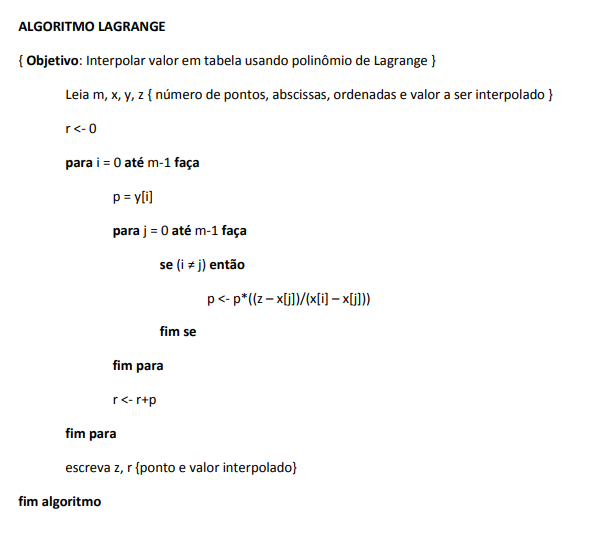

# Projeto de Matemática Computacional

Projeto para a disciplina de Matemática Computacional, do 7º período do curso de Ciência da Computação do Instituto Federal do Sul de Minas Gerais (IFSULDEMINAS) - Campus Muzambinho.

## Interpolação Polinomial de Lagrange

A **interpolação de Lagrange** é um método da análise numérica para encontrar um polinômio único, de grau mínimo, que passa por um conjunto específico de pontos. Dado um conjunto de $k+1$ pontos $(x_0, y_0), (x_1, y_1), \ldots, (x_k, y_k)$, onde todos os $x_j$ são distintos, existe um único polinômio $P(x)$ de grau no máximo $k$ que assume o valor $y_j$ em cada ponto $x_j$ correspondente.

O objetivo é aproximar uma função ou estimar valores entre os pontos conhecidos.

O polinômio interpolador de Lagrange é dado pela fórmula:

$$P(x) = \sum_{j=0}^{k} y_j L_j(x)$$

Onde cada $L_j(x)$ é um **polinômio de base de Lagrange**, definido como:

$$L_j(x) = \prod_{i=0, i \neq j}^{k} \frac{x-x_i}{x_j-x_i}$$

Cada polinômio de base $L_j(x)$ tem a propriedade de ser igual a 1 em $x = x_j$ e igual a 0 em todos os outros pontos $x_i$ (com $i \neq j$), garantindo que o polinômio final $P(x)$ passe por todos os pontos dados.

---

